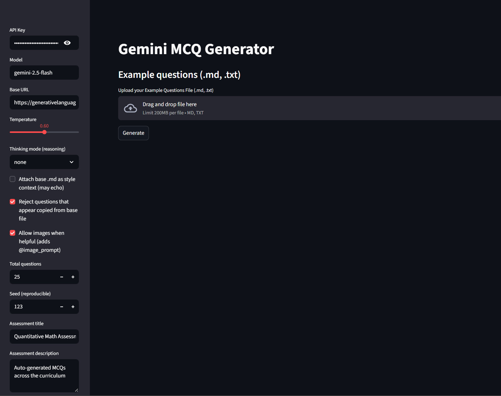
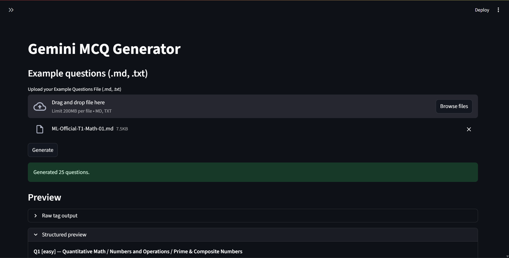
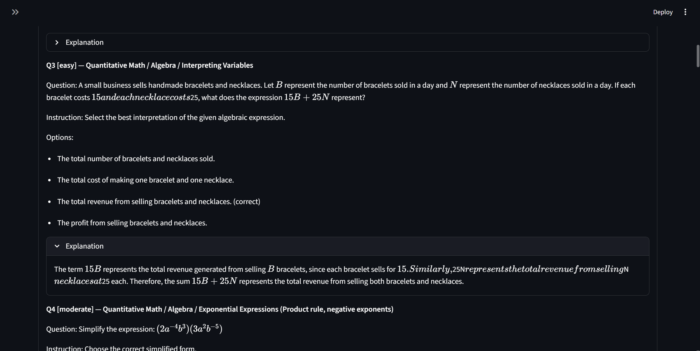

Gemini MCQ Generator (Python + Streamlit)

Purpose
Create assessment-ready MCQs that follow a strict tag format, stay aligned to a provided curriculum, and preserve LaTeX. Use a simple UI to generate, preview, and export.

Screenshots





Highlights
- Curriculum tagging: `@subject`, `@unit`, `@topic` strictly selected from `data/curriculum.json`.
- Exact tag format output to `assessment.txt` with light cleanup (e.g., `\/` → `/`).
- LaTeX preserved in text; live preview renders math to check formatting.
- Duplicate check (optional) against a provided base `.md`.
- Optional image prompts (off by default). .docx export via download button only (no file written).

Requirements
- Python 3.10+
- A Gemini API key (Google AI Studio)

Quick start (Windows PowerShell)
```powershell
cd D:\ml
python -m venv .venv
.\.venv\Scripts\Activate.ps1
pip install -r requirements.txt
```

Environment variables (optional)
Set in the sidebar, or create a local `.env` (not checked in):
```dotenv
GOOGLE_API_KEY=YOUR_KEY
GEMINI_MODEL=gemini-2.5-pro
GEMINI_BASE_URL=https://generativelanguage.googleapis.com/v1beta/openai/
```

Run
```powershell
streamlit run app\streamlit_app.py
```

Using the app
1) Sidebar
   - API Key, Model, Base URL
   - Temperature and Thinking mode (none/low/medium/high)
   - Total questions and Seed
   - Attach base .md as style context (optional)
   - Reject copies (optional)
   - Allow images when helpful (optional)
   - Assessment title/description

2) Base questions (.md)
   - Upload a `.md` or `.txt` (optional). If a local `ML-Official-T1-Math-01.md` exists, it can be used for style/duplicate checks.

3) Generate
   - Preview: LaTeX‑rendered questions, instructions, options, explanations, curriculum tags.
   - Download: `.txt` (tags) and `.docx` (Word). The .docx is streamed only.

Output format
Each question follows this template:
```text
@question ...
@instruction ...
@difficulty easy|moderate|hard
@Order <number>
@option ...
@@option Correct Answer
@option ...
@option ...
@explanation
...
@subject Quantitative Math
@unit <unit>
@topic <topic>
@plusmarks 1
```
The file starts with:
```text
@title <title>
@description <description>
```

Project layout
```
app/streamlit_app.py      # Streamlit UI + generation logic
data/curriculum.json      # Curriculum triples (subject, unit, topic)
requirements.txt          # Python dependencies
README.md                 # This file
assets/                   # Add screenshots here (sidebar.png, preview-1.png, preview-2.png)
 ENV.example               # Example env vars (local only)
.gitignore                # Ignore venv, caches, local outputs
```

Environment example
See `ENV.example` for a template if you prefer a file.

Troubleshooting
- 404 or empty content: check model access/quota. Confirm `GEMINI_MODEL`.
- Parameter errors: use `reasoning_effort` (none/low/medium/high) instead of `reasoning`.
- Invalid JSON escapes: the parser auto-fixes most LaTeX backslash issues.
- Reused source text: enable “Reject copies” or disable style context.


Python Streamlit - Gemini MCQ Generator

What it does
- Generates MCQs in your tag format using Gemini (OpenAI-compatible endpoint).
- Preserves LaTeX in questions/options/explanations.
- Distributes questions across your curriculum topics with mild randomness.
- Outputs .txt (tag format) and optional .docx.

Setup (Windows PowerShell)
```powershell
cd D:\ml
python -m venv .venv
.\.venv\Scripts\Activate.ps1
pip install -r requirements.txt
$env:GOOGLE_API_KEY="YOUR_GOOGLE_AI_STUDIO_KEY"
$env:GEMINI_MODEL="gemini-2.5-pro"            # optional
$env:GEMINI_BASE_URL="https://generativelanguage.googleapis.com/openai/"  # optional
```

Run
```powershell
streamlit run app\streamlit_app.py
```

Usage
- Upload your base `.md` file (or it will fallback to `ML-Official-T1-Math-01.md` if present).
- Choose total count (e.g., 25), temperature, and seed for reproducibility.
- Click Generate and download `assessment.txt` and optionally `assessment.docx`.

Notes
- Exactly 4 options per question; one marked with `@@option`.
- Strictly uses `@subject`, `@unit`, `@topic` from `data/curriculum.json`.
- If the OpenAI-compatible path changes, update Base URL in the sidebar (try `https://generativelanguage.googleapis.com/v1beta/openai/`).


